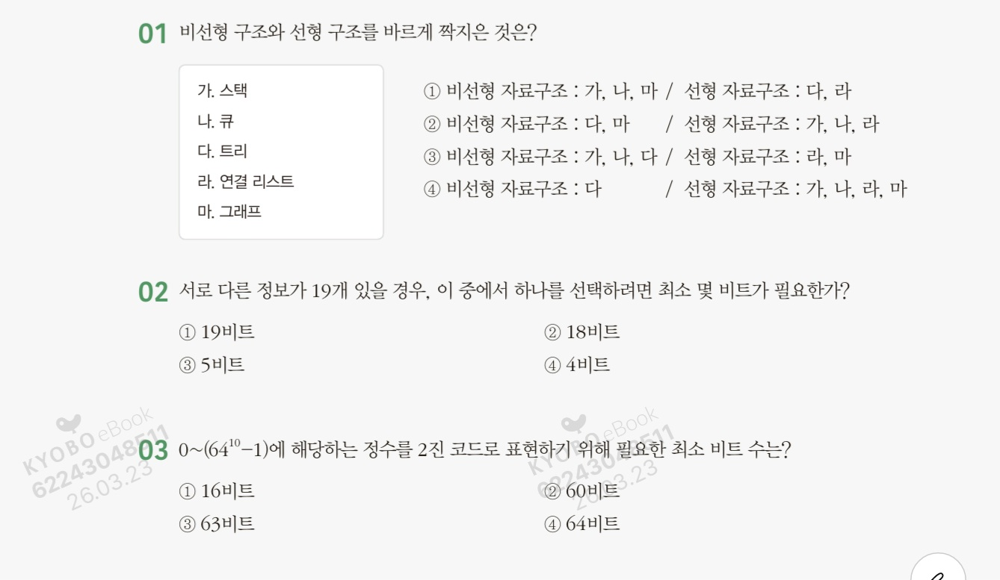

# 알고리즘 수업 정리 3주차

**1번 풀이: 정답 2.**
자료구조는 데이터가 나열된 형태에 따라 크게 두 가지로 나뉩니다.

- **선형 구조 (Linear Structure):** 데이터가 일렬로 연결된 형태입니다. (가. 스택, 나. 큐, 라. 연결 리스트, 배열 등)
- **비선형 구조 (Non-Linear Structure):** 데이터가 일직선이 아닌 계층적 혹은 망 형태로 연결된 형태입니다. (다. 트리, 마. 그래프)

**2번 풀이: 정답 3.**
n개의 비트로 표현할 수 있는 정보의 개수는 2^n개입니다. 19개의 정보를 모두 식별하기 위해서는 2^n 보다 작거나 같은 19를 만족하는 최소의 정수 n을 찾아야 합니다.
• 4비트(2^4): 16가지 표현 가능 (19개를 다 담지 못함)
• **5비트(2^5): 32가지 표현 가능 (19개를 충분히 식별 가능)**
따라서 최소 **5비트**가 필요합니다.

**3번 풀이: 정답 2.**
먼저 64^10을 2의 거듭제곱 형태로 변환해야 계산이 쉽습니다.
1. 64는 2^6입니다.
2. 따라서 64^10 = (2^6)^10 = 2^60입니다.
3. 문제에서 요구하는 범위는 0~(2^60-1)입니다.
일반적으로 n비트로 표현할 수 있는 정수(양수)의 범위는 0~(2^n-1)입니다.
식의 형태를 비교해 보면 n=60임을 알 수 있습니다. 즉, **60비트**가 있어야 해당 범위를 모두 표현할 수 있습니다.

**4번 풀이: 정답 4.**
팩 형식에서 가장 중요한 규칙은 **'마지막 자리는 부호'**라는 점입니다.

1. **숫자 해석하기**
    - **A:** `00 04 09 5C` → 마지막 `C`는 **양수(+)**를 뜻합니다. 따라서 이 숫자는 **+4095**입니다.
    - **B:** `00 03 84 0D` → 마지막 `D`는 **음수(-)**를 뜻합니다. 따라서 이 숫자는 **3840**입니다.
    
    > (참고: 보통 C는 +, D는 -, F는 부호 없음을 의미해요!)
    > 
2. **연산하기**
    - 문제에서 A와 B를 더하라고 했으니: `(+4095) + (-3840)`
    - 계산하면: `4095 - 3840 = 255`가 나옵니다. 결과값은 **양수(+255)**입니다.
3. **다시 팩 형식으로 바꾸기**
    - 숫자 **255**를 팩 형식 칸에 채우고, 마지막에 양수 부호인 **C**를 붙입니다.
    - 앞의 빈칸은 0으로 채우면: `00 00 25 5C` 가 됩니다.

**5번 풀이: 정답 3.**
그림에 표시된 `d`와 `s`가 무엇을 의미하는지 알면 바로 풀리는 문제입니다.

1. **구조 파악**
    - **d (digit):** 숫자가 들어가는 자리입니다. (0~9까지의 숫자 한 개씩)
    - **s (sign):** 부호가 들어가는 자리입니다. (+ 또는 -)
2. **그림 분석**
    - 그림을 보면 `d`가 3개, `s`가 1개 있습니다.
    - 이것은 **세 자리 정수**와 **부호** 하나를 표현할 수 있다는 뜻입니다.
3. **보기 대조**
    - ① 23: 두 자리 숫자라 칸이 남습니다.
    - ② 23.1: 팩 형식은 기본적으로 **정수**를 표현하므로 소수점은 들어가지 않습니다.
    - ③ **234**: **세 자리 정수**이면서 **부호(-)**가 있으므로 딱 맞습니다!
    - ④ 1234: 네 자리 숫자라 `d`가 4개 필요하므로 들어갈 수 없습니다.

**6번 풀이: 정답 1.**
팩 형식의 규칙을 그대로 적용하면 됩니다.

1. **숫자 채우기:** 456이라는 숫자를 순서대로 4비트씩(16진수 한 자리씩) 채웁니다. → `4, 5, 6`
2. **부호 붙이기:** 팩 형식의 **맨 마지막** 자리는 부호 자리입니다.
    - *양수(+)**면 **C**
    - *음수(-)**면 **D**
3. **결합:** -456은 음수이므로 마지막에 `D`를 붙여서 `4 5 6 D`가 됩니다. 2자리씩 끊어서 표현하면 `45 6D`입니다.

**7번 풀이: 정답 2.**

1. **숫자를 2진수로 바꾸기:**
    - **+9:** `0000 1001`
    - **+24:** `0001 1000`
2. **24를 1의 보수로 만들기:**
    - 1의 보수는 0을 1로, 1을 0으로 다 뒤집으면 됩니다.
    - `0001 1000` (+24) → `1110 0111` (-24)
3. **두 수를 더하기:**
    - `0000 1001` (+9) + `1110 0111` (-24) = **`1111 0000`**

**8번 풀이: 정답 2.**

제시된 비트 패턴은 `1110 1101`입니다. 맨 앞이 **1**이므로 모두 **음수**입니다.
• **(가) 부호와 절대값:**
    ◦ 맨 앞 `1`은 마이너스(-), 나머지 `110 1101`을 숫자로 읽습니다.
    ◦ 64 + 32 + 8 + 4 + 1 = 109. 즉, **-109**입니다.
• **(나) 1의 보수:**
    ◦ 전체 비트를 반전시켜 봅니다. `1110 1101` → `0001 0010`
    ◦ 반전시킨 숫자는 16 + 2 = 18입니다. 원래 음수였으니 **-18**입니다.
• **(다) 2의 보수:**
    ◦ 2의 보수는 **"1의 보수 결과에 1을 더한 것"**입니다.
    ◦ (나)에서 구한 18에 1을 더하면 19가 됩니다. 원래 음수였으니 **-19**입니다.

**9번 풀이: 정답 4.**

- **① 0은 한 가지만 존재합니다.** (1의 보수는 +0, -0 두 개지만, 2의 보수는 0이 딱 하나라 효율적이에요.)
- **③ end around carry(최종 올림수 처리) 과정이 없습니다.** (이건 1의 보수에서 하는 작업이에요.)
- **④의 의미:** 2의 보수는 0을 하나로 합치면서 남는 자리에 음수를 하나 더 표현할 수 있습니다. 예를 들어 8비트라면 양수는 +127까지인데, 음수는 -128까지 표현 가능해서 **음수가 1 더 많습니다.**

**10번 풀이: 정답 1.**
• n비트 중 맨 앞 1비트는 부호(+/-) 자리라서, 실제 숫자를 쓰는 자리는 **n-1개**입니다.
• 그래서 2^{n-1}만큼의 크기를 가지는데, 1의 보수는 **0이 두 개(+0, -0)**라서 양쪽 끝에서 1씩을 빼줘야 합니다.
• 따라서 공식 모양이 (2^{n-1}-1) 형태가 됩니다.

**11번 풀이: 정답 1.**

- **부호와 절대값, 1의 보수:** 0을 두 개(+0, -0)로 중복해서 표현하기 때문에 숫자를 하나 손해 봅니다.
- **2의 보수:** 0을 하나로 표현하는 대신, 남는 자리에 **음수 하나를 더(-128 같은 숫자)** 집어넣습니다.
- 결과적으로 다른 방식들보다 **숫자 하나를 더 표현**할 수 있어 범위가 가장 넓습니다.

**12번 풀이: 정답 3.**
1. **비트 나누기:** 8비트 중 부호 1비트를 빼면 숫자는 **7비트**입니다.
2. **계산:** * 양수 쪽은 0이 포함되므로 하나 적은 **2^7-1** (+127)까지.
    ◦ 음수 쪽은 2의 보수 특성상 하나 더 많은 **-2^7** (-128)까지 가능합니다.
3. 그래서 정답은 **-2^7 ~2^7-1** 모양인 3번입니다.

**13번 풀이: 정답 4.**

- 1의 보수는 `+0`과 `0`이 따로 있어서 0을 표현하는 데 자리를 두 개나 차지합니다.
- 하지만 **2의 보수**는 0이 딱 하나뿐이에요.
- 덕분에 남는 자리에 **음수 하나를 더** 집어넣을 수 있어서, 총 표현할 수 있는 숫자의 개수가 1개 더 많고 계산기(CPU)를 만들 때도 훨씬 효율적입니다.

**14번 풀이: 정답 2.**
맨 앞 숫자가 **1**이므로 이 숫자는 **음수**입니다. 음수를 읽을 때는 거꾸로 '원래 숫자'를 찾아가야 해요.

1. **1을 뺍니다:** `10111100` - 1 = `10111011`
2. **전부 뒤집습니다 (0↔1):** `01000100`
3. **10진수로 계산합니다:** * 2의 6승(64) + 2의 2승(4) = **68**
4. **부호를 붙입니다:** 원래 음수였으므로 정답은 **68**입니다.

**15번 풀이: 정답 3.**
**오버플로**는 "같은 부호끼리 더했는데 결과가 다른 부호로 바뀌어버릴 때" 발생합니다. (플러스끼리 더했는데 마이너스가 나오거나, 그 반대인 경우)
• ① **양수(0) + 양수(0)** = 결과가 `011001`(양수). 정상입니다.
• ② 1번과 같은 문제입니다. (이미지에 중복된 보기가 있네요!)
• ③ **음수(1) + 음수(1)** = `110010` + `111001`
    ◦ 앞자리만 계산해볼까요? 1 + 1은 10이 되어서 자릿수가 올라가고, 부호 자리가 **0(양수)**으로 바뀔 위험이 큽니다. 실제로 더하면 범위를 넘어가게 됩니다.
• ④ **양수(0) + 양수(0)** = 결과가 양수. 정상입니다.

**핵심 팁:** 오버플로는 **부호가 같은 것끼리 더할 때만** 걱정하면 됩니다! 양수+음수는 절대 오버플로가 안 나요. 3번처럼 **음수+음수**인데 자릿수가 넘쳐서 부호가 바뀌는 상황이 바로 정답입니다.

**16번 풀이: 정답 2.**
1. **정규화하기:** 소수점을 첫 번째 '1' 뒤로 옮겨야 합니다.
    ◦ 0.01101에서 소수점을 오른쪽으로 **2칸** 옮기면 1.101이 됩니다.
    ◦ 오른쪽으로 2칸 갔으므로 지수는 **-2**가 됩니다. (즉, 1.101 \times 2^{-2})
2. **바이어스(Bias) 더하기:** IEEE 754 단정도(32비트) 방식에서는 실제 지수에 **127**을 더해줍니다.
    ◦ -2 + 127 = 125
3. **2진수로 변환:** 125를 2진수로 바꾸면 **01111101_2**이 됩니다.
    ◦ (127이 01111111이니까, 거기서 2를 뺀 01111101이라고 생각하면 빨라요!)

**17번 풀이: 정답 4.**
• **①, ②, ③은 모두 맞는 설명입니다.** (지수 8비트, 바이어스 127, 가수 23비트, 부호 1비트 = 총 32비트)
• **④이 틀린 이유:** 10^{308}급의 엄청나게 큰 범위는 32비트가 아니라 **64비트(배정도, Double Precision)** 방식의 특징입니다. 32비트는 대략 10^{38} 정도까지만 표현 가능해요.

**18번 풀이: 정답 1.**
우리가 1.2 x 10^3과 3.4 x 10^2을 더할 때를 상상해 보세요.
1. **B (지수 비교):** 지수(3과 2)가 다른 걸 확인합니다.
2. **C (가수 정렬):** 지수를 큰 쪽에 맞춰서 자릿수를 맞춥니다. (0.34 x 10^3으로 변경)
3. **D (가수 덧셈):** 이제 숫자끼리 더합니다. (1.2 + 0.34 = 1.54)
4. **A (정규화):** 결과가 규칙에 맞는지(예: 15.4 x 10^2가 나왔다면 1.54 x 10^3으로) 최종 정리합니다.

**19번 풀이: 정답 2.**

- **BCD(Binary Coded Decimal)**는 10진수 숫자 하나를 딱 4비트씩 끊어서 표현하는 방식입니다.
- 사람이 쓰는 10진수 숫자를 컴퓨터가 복잡한 변환 과정 없이 바로 0과 1의 묶음으로 처리할 수 있게 해주기 때문에, **사용자와 대화하는 입출력 장치**에서 아주 편리하게 사용됩니다.

**20번 풀이: 정답 4.**
• **4비트가 가진 총 능력:** 4비트로는 총 2^4 = 16가지 상태를 표현할 수 있습니다.
• **BCD (2진화 10진수):** 이름처럼 **10진수(0~9)**만 표현합니다. 즉, 16가지 능력 중 **10개**만 사용합니다.
• **2진화 16진수:** 16진수 전체(**0~15**, 즉 0~F)를 다 표현합니다. 즉, **16개**를 다 사용합니다.
• **차이:** 16 - 10 = 6. 따라서 16진수가 **6개**를 더 표현할 수 있습니다.

**21번 풀이: 정답 3.**

- **①이 틀린 이유:** EBCDIC(앱스딕)은 주로 **대형 컴퓨터(Mainframe)**용으로 쓰입니다. 소형은 ASCII를 주로 쓰죠.
- **②이 틀린 이유:** ASCII는 IBM이 아니라 **미국 표준 협회(ANSI)**에서 개발했으며, 주로 **PC나 데이터 통신용**으로 쓰입니다.
- **③이 맞는 이유:** 비트(Bit)는 **B**inary Dig**it**의 줄임말로, 0과 1을 나타내는 컴퓨터의 최소 단위가 맞습니다.
- **④이 틀린 이유:** 부동소수점은 정수 방식보다 비트를 **많이** 차지하고 복잡하지만, 아주 정밀하고 큰 숫자를 표현할 수 있는 방식입니다.

**22번 풀이: 정답 4.**
알고리즘의 필수 조건 5가지는 다음과 같습니다.

1. **입력:** 외부에서 제공되는 데이터가 0개 이상 있어야 함.
2. **출력:** 적어도 **1개 이상의 결과**가 나와야 함. (보기 ①번 내용)
3. **명확성:** 각 단계는 **모호하지 않고 명확**해야 함. (보기 ②번 내용)
4. **유한성:** 반드시 **유한한 단계 후에 종료**되어야 함. (보기 ③번 내용)
5. **유효성:** 모든 명령은 종이와 연필로 수행할 수 있을 정도로 **실행 가능**해야 함.
- **④이 틀린 이유:** 알고리즘은 논리적인 '순서' 그 자체를 말합니다. 꼭 특정 프로그래밍 언어로 써야 하는 것은 아니며, 순서도(Flowchart)나 일반 언어(의사코드)로 작성해도 충분합니다.

**23번 풀이: 정답 3.**
시간 복잡도는 데이터가 늘어날 때 시간이 얼마나 더 걸리는지를 나타냅니다. 숫자가 작거나 증가 폭이 완만할수록 성능이 좋은 것입니다.
1. **O(1) (상수 시간):** 데이터가 몇 개든 시간이 항상 일정함. **가장 빠름.** (B)
2. **O(n log n) (로그 선형 시간):** 효율적인 정렬 알고리즘의 속도. (C)
3. **O(n^2) (2차 시간):** 데이터가 많아질수록 기하급수적으로 느려짐. (A)
4. **O(2^n) (지수 시간):** 데이터가 조금만 늘어도 처리가 불가능할 정도로 느려짐. **가장 느림.** (D)

**24번 풀이: 정답 3.**

- 괄호 안의 숫자 **'1'**은 '데이터가 1개'라는 뜻이 아니라, **'상수(Constant)'**를 의미합니다.
- 데이터가 10개든, 1억 개든 상관없이 항상 일정한 시간(예: 배열의 첫 번째 값 찾기 등)이 걸리는 경우를 O(1)이라고 부릅니다.

**25번 풀이: 정답 4.**
Big-O 표기법은 **"가장 영향력이 큰 놈만 남긴다"**는 규칙이 있습니다.
• **덧셈 규칙 (+):** 두 복잡도를 더하면 **더 큰 쪽**이 이깁니다.
    ◦ ① O(n) + O(n) = O(n) (차수가 같으므로 그대로)
    ◦ ② O(n^2) + O(n log n) = O(n^2) (n^2이 더 크므로 승리)
    ◦ ③ O(n^2) + O(n) = O(n^2) (n^2이 더 크므로 승리)
• **곱셈 규칙 (*):** 두 복잡도를 곱하면 **서로 곱한 결과**가 나옵니다.
    ◦ ④ O(log n) * O(n^2)을 곱하면 **O(n^2 log n)**이 되어야 합니다. 그냥 O(n^2)으로 퉁칠 수 없기 때문에 4번이 틀린 것입니다.

**26번 문제 요약:** 1~200 사이의 숫자 중 '자신을 제외한 약수를 모두 더했을 때 자기 자신이 되는 수(완전수)'를 찾아 그 개수를 세는 알고리즘입니다.

- **① 정답: 6 (SU+1)**
    - **풀이:** 한 숫자에 대한 검사가 끝났으면 다음 숫자로 넘어가야 합니다. `SU`를 1씩 증가시키는 단계이므로 `SU=SU+1`이 적절합니다.
- **② 정답: 14 (J+1)**
    - **풀이:** 약수인지 확인하기 위해 나누는 수 `J`를 1부터 2, 3... 순서대로 키워가며 검사해야 합니다. 루프가 반복될 때마다 `J`를 증가시켜야 하므로 `J=J+1`입니다.
- **③ 정답: 2 (J)**
    - **풀이:** 나머지(`REM`)를 구하는 공식 `REM = SU - (SU / J) * J`에서 `J`는 나누는 수입니다. (컴퓨터에서 나머지는 '배당수 - (몫 * 제수)'로 계산합니다.)
- **④ 정답: 11 (SUM+J)**
    - **풀이:** 나머지(`REM`)가 0이라는 것은 `J`가 약수라는 뜻입니다. 약수를 찾으면 합계(`SUM`)에 누적해야 하므로 `SUM=SUM+J`가 됩니다.
- **⑤ 정답: 15 (SU)**
    - **풀이:** 약수의 총합(`SUM`)이 원래 숫자와 같은지 확인하는 단계입니다. 따라서 `(SU) = SUM` 조건이 되어야 완전수인지 판별할 수 있습니다.

**27번 문제 요약:** 10개의 정수를 입력받아 그중 가장 작은 값을 뺀 나머지 9개 값의 평균을 구하는 과정입니다.

- **① 정답: 7 (J)**
    - **풀이:** 입력받은 배열을 훑으면서 합계와 최솟값을 찾아야 합니다. 제어 변수 `J`가 10이 될 때까지 반복해야 하므로 반복문의 탈출 조건인 `(J)=10`이 들어갑니다.
- **② 정답: 24 (SUM)**
    - **풀이:** 새로운 값을 더해나가는 과정입니다. 기존 합계에 현재 배열의 값을 더해야 하므로 `SUM=(SUM)+ARRAY(J)`가 됩니다.
- **③ 정답: 18 (ARRAY(J))**
    - **풀이:** 현재 값(`ARRAY(J)`)이 기존 최솟값(`MIN`)보다 작다면, 최솟값을 현재 값으로 갈아치워야 합니다. 따라서 `MIN=(ARRAY(J))`가 됩니다.
- **④ 정답: 26 (SUM-MIN)**
    - **풀이:** 반복문이 끝나면 `SUM`에는 10개 전체의 합이 들어있습니다. 문제에서 '최솟값을 제외'하라고 했으므로 전체 합에서 최솟값을 뺍니다. `SUM=SUM-MIN`.
- **⑤ 정답: 33 (SUM/9)**
    - **풀이:** 최솟값을 뺀 나머지 9개 숫자의 평균이므로, 9로 나누어야 합니다. `AVG=SUM/9`.

**28번 풀이: 정답 2.**

1. **코드 분석:** 코드를 보면 `if (A[i] > A[i+1]) then A[i] ↔ A[i+1]`이라는 부분이 핵심입니다. 인접한 두 데이터를 비교해서 큰 것을 뒤로 보내는 방식이죠.
2. **알고리즘 판별:** 이처럼 이웃한 요소끼리 자리를 바꾸며 제일 큰 값을 맨 뒤로 보내는 방식은 **거품 정렬(Bubble Sort)**입니다. (선택 정렬은 전체 중 최솟값을 찾아 맨 앞으로 보내는 방식이라 코드가 다릅니다.)
3. **기타 보기:** * ①, ④번은 거품 정렬의 특징을 잘 설명하고 있습니다.
    - ③번은 이중 loop이므로 O(n^2)의 수행 시간을 가지는 것이 맞습니다.

**29번 풀이: 정답 3.**
반복문(for)이 중첩되어 있을 때는 안쪽 코드가 총 몇 번 실행되는지 곱해보면 됩니다.
1. 첫 번째 `for (i=1; i<n; i++)`: 약 n번 반복
2. 두 번째 `for (j=1; j<=n; j=j+1)`: n번 반복
3. 세 번째 `for (k=1; k<=n; k++)`: n번 반복
4. **결과:** n x n x n = n^3이 됩니다. 따라서 시간 복잡도는 **세타(n^3)**입니다.

**30번 풀이: 정답 2.**
이 문제는 함정이 하나 숨어 있어요. `for`문이 세 개라 n^3이라고 생각하기 쉽지만, 반복 횟수를 자세히 봐야 합니다.
1. `for (i=0; i < (n-5); i++)`: **(n-5)번** 반복합니다. (거의 n번)
2. `for (k=0; k < 100; k++)`: n과 상관없이 **무조건 100번** 반복합니다. (상수)
3. `for (m=0; m < 1000; m++)`: n과 상관없이 **무조건 1000번** 반복합니다. (상수)
4. **계산:** (n-5) x 100 x 1000 = 100,000n - 500,000
5. **빅-오 법칙:** 빅-오 표기법에서는 가장 큰 차수만 남기고 앞의 계수(숫자)는 버립니다. 따라서 최종 복잡도는 **O(n)**이 됩니다.

**31번 풀이: 정답 64개.**

비트가 n개일 때 표현할 수 있는 정보의 가짓수는 2^n입니다.
2 x 2 x 2 x 2 x 2 x 2 = 64이므로,

**64개**

의 상태를 표현할 수 있습니다.

**32번 풀이: 정답** 

- **존(Zone) 형식:** **F5 F1 F6** (양수), **F5 F1 D6** (음수)
- **팩(Packed) 형식:** **51 6C** (양수), **51 6D** (음수)
1. **존 형식:** 한 숫자를 8비트(F+숫자)씩 표현합니다. 마지막 숫자의 'F' 자리에 부호를 넣습니다.
    - 양수 부호: **F** (또는 C), 음수 부호: **D**
    - 516 → `F5 F1 F6` / -516 → `F5 F1 D6`
2. **팩 형식:** 4비트씩 숫자를 채우고 맨 마지막 4비트에 부호를 넣습니다.
    - 양수 부호: **C**, 음수 부호: **D**
    - 516 → `5 1 6 C` (두 자리씩 끊으면 `51 6C`)
    - 516 → `5 1 6 D` (두 자리씩 끊으면 `51 6D`)
    
    > **잠깐!** 이미지의 손글씨에는 팩 형식이 `51 6C`로 되어 있는데, 이는 3자리를 4자리로 맞추기 위해 앞에 0이 생략된 형태(`05 16 C`)로 보기도 합니다. 보통은 `05 16 C`처럼 바이트 단위로 딱 떨어지게 씁니다.
    > 

**33번 풀이: 정답** 

- **+62: 0011 1110**
- **62: 1011 1110**
1. **숫자 변환:** 62를 2진수로 바꾸면 `11 1110` (32+16+8+4+2)입니다.
2. **형식 맞추기:** 8비트 중 맨 앞은 **부호(양수 0, 음수 1)**, 나머지는 **절대값**입니다.
3. **결과:**
    - 양수: `0` + `011 1110` = `0011 1110`
    - 음수: `1` + `011 1110` = `1011 1110` (부호 비트만 1로 바뀜)

**34번 풀이: 정답** 

- **+62: 0011 1110**
- **62: 1100 0001**
1. **양수 표현:** 1의 보수에서도 양수는 **부호와 절대값 방식과 똑같습니다.** (`0011 1110`)
2. **음수 표현:** 양수 상태에서 모든 비트를 **반전(0↔1)** 시킵니다.
    - `0011 1110` → **`1100 0001`**

**35번 핵심 답변: 자료구조는 효율적인 문제 해결을 위한 '공구함'이기 때문입니다.**

- **성능의 차이:** 똑같은 기능을 하는 프로그램이라도 어떤 자료구조를 썼느냐에 따라 실행 속도가 1초가 걸릴 수도, 1시간이 걸릴 수도 있습니다. (예: 100만 명 중 한 명을 찾을 때, 그냥 나열된 명단에서 찾느냐 가나다순으로 정렬된 트리에서 찾느냐의 차이)
- **자원의 효율적 사용:** 메모리(공간)와 CPU(시간)는 한정되어 있습니다. 자료구조를 잘 알면 데이터를 최소한의 메모리로 가장 빠르게 처리하는 '가성비' 좋은 코드를 짤 수 있습니다.
- **논리적 사고 훈련:** 복잡한 현실 세계의 데이터를 컴퓨터가 이해할 수 있는 논리적 구조로 설계하는 과정 그 자체가 개발자의 사고력을 키워줍니다.

**36번 핵심 답변: 자료구조는 모든 컴퓨터 전공 과목을 관통하는 '기반 기술'입니다.**

- **알고리즘:** 자료구조는 '재료'이고 알고리즘은 '레시피'입니다. 좋은 재료가 없으면 좋은 요리가 나올 수 없듯, 알고리즘과 자료구조는 뗄 수 없는 관계입니다.
- **운영체제(OS):** 프로세스 관리(큐), 메모리 할당, 파일 시스템(트리) 등 OS의 핵심 기능이 모두 자료구조로 구현되어 있습니다.
- **데이터베이스(DB):** 대량의 데이터를 빠르게 검색하기 위한 인덱스(B-Tree)나 해시 등은 자료구조의 결정체입니다.
- **컴파일러:** 프로그래밍 언어를 해석할 때 코드의 구조를 트리 형태로 분석합니다.

**37번 핵심 답변: 추상화는 '무엇(What)'을 할지 정의하는 것이고, 구체화는 '어떻게(How)' 구현할지 결정하는 것입니다.**

- **추상화 (Abstraction):** 복잡한 내부 구현은 숨기고 사용자에게 필요한 **기능과 인터페이스만 추출**하는 것입니다.
    - *예:* 자동차 운전. 운전자는 핸들(기능)만 알면 되지, 엔진 내부에서 피스톤이 어떻게 움직이는지(구현)는 알 필요가 없습니다. 자료구조에서는 **ADT(추상 데이터 타입)**가 여기에 해당합니다.
- **구체화 (Concretization):** 추상화된 기능을 **실제 프로그래밍 언어로 코딩하여 구현**하는 단계입니다.
    - *예:* '리스트'라는 추상적인 개념을 '배열'을 써서 만들지, '연결 리스트'를 써서 만들지 실제로 메모리에 배치하고 코드를 짜는 과정입니다.

**38번 핵심 답변: 알고리즘이란 어떤 문제를 해결하기 위한 명확한 '절차나 방법'입니다.**

앞서 문제 22번에서도 살짝 다뤘지만, 좋은 알고리즘이 되기 위해서는 다음 **5가지 조건**을 반드시 충족해야 합니다.

1. **입력(Input):** 외부에서 제공되는 자료가 0개 이상 존재해야 합니다.
2. **출력(Output):** 적어도 1개 이상의 결과가 나와야 합니다.
3. **명확성(Definiteness):** 각 단계는 애매모호하지 않고 의미가 분명해야 합니다.
4. **유한성(Finiteness):** 반드시 유한한 단계를 거친 후에는 종료되어야 합니다. (무한 루프는 알고리즘이 아닙니다.)
5. **유효성(Effectiveness):** 모든 명령은 지극히 기본적인 것이어서 실제로 수행 가능해야 합니다.

**39번 풀이 및 순서도 구조:**
이 알고리즘은 바깥쪽 루프(`i`)가 n번 도는 동안 안쪽 루프(`j`)도 n번씩 도는 구조입니다.
1. **시작(START):** 시작 기호.
2. **초기화:** `i = 1`.
3. **바깥쪽 조건문:** `i <= n` 인지 확인. (No면 종료)
4. **안쪽 루프 시작:** `j = 1`.
5. **안쪽 조건문:** `j <= n` 인지 확인.
    ◦ **Yes일 때:** `A = A + B` 실행 후 `j = j + 1`을 하고 다시 안쪽 조건문으로 이동.
    ◦ **No일 때:** `i = i + 1`을 하고 다시 바깥쪽 조건문으로 이동.
6. **종료(END):** 모든 루프가 끝나면 종료.

**40번 문제:** 알고리즘의 성능 분석 방법인 두 개념에 대해 설명하시오.

- **시간 복잡도 (Time Complexity):** 알고리즘이 실행되어 종료될 때까지 걸리는 **시간**을 분석하는 것입니다. 보통 실제 시간이 아닌 **'연산의 횟수'**를 기준으로 측정합니다.
- **공간 복잡도 (Space Complexity):** 알고리즘이 실행되는 동안 필요로 하는 **메모리(기억 공간)의 양**을 분석하는 것입니다. 최근에는 메모리 용량이 커져서 시간 복잡도를 더 중요하게 여기는 추세입니다.

**41번 문제:** 39번 알고리즘의 시간 복잡도를 빅-오로 표현하시오.
• **정답: $O(n^2)$**
• **풀이:**
바깥쪽 루프가 $n$번 반복되고, 그 루프가 한 번 돌 때마다 안쪽 루프도 $n$번 반복됩니다. 전체 연산 횟수는 $n \times n = n^2$에 비례하므로 **$O(n^2)$**이 됩니다.

**42번 문제:** 2 log n + 3n^3 + 9999n^2 + 15일 때, 시간 복잡도를 빅-오로 표현하시오.
• **정답: $O(n^3)$**
• **풀이:**
빅-오 표기법을 구할 때는 두 가지만 기억하세요!
    1. **가장 영향력이 큰 항(최고차항)**만 남깁니다. (n^3이 log n이나 n^2보다 훨씬 큽니다.)
    2. **계수(숫자)**는 무시합니다. (앞의 `3`은 떼어냅니다.)
결과적으로 가장 차수가 높은 **n^3**만 남아 **O(n^3)**이 됩니다.