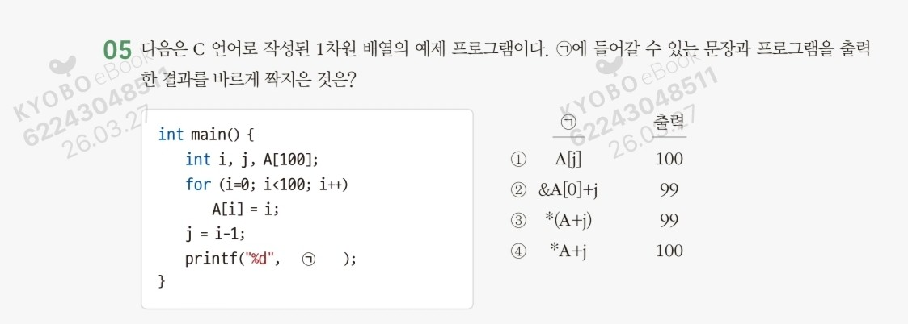

# 알고리즘 수업 정리 5주차

## 포인터 배열 / 이중 포인터 / 구조체 / 재귀호출 (pp. 89~112)

---

### 6. 포인터 배열(Section 2 이어서)

포인터 배열은 여러 개의 포인터를 하나의 배열로 구성한 것으로, **배열과 포인터의 특징을 모두 활용**할 수 있다.

### 선언 형식

```c
자료형 *포인터배열이름[배열크기];
```

### 2차원 배열 vs 1차원 포인터 배열 비교

**2차원 배열 선언 예:**

```c
char string[3][10] = { "Dreams", "come", "true!" };
```

- string[0] → D r e a m s \0
- string[1] → c o m e \0
- string[2] → t r u e ! \0

> 배열은 선언될 때 지정한 크기의 배열 공간이 메모리에 할당됨.
> 
> 
> 한 번 할당된 배열은 크기를 줄이거나 늘리기 어렵기 때문에 실제 사용 공간이 작으면 메모리 낭비, 크면 배열을 새로 만들어야 하는 문제 발생.
> 

**1차원 포인터 배열 선언 예:**

```c
char *ptr[3] = { {"Dreams"}, {"come"}, {"true!"} };
```

- ptr[0] → D r e a m s \0
- ptr[1] → c o m e \0
- ptr[2] → t r u e ! \0

> 포인터 배열은 저장하는 문자열의 길이에 따라 메모리가 할당됨.
> 
> 
> 문자열의 길이를 정확히 예측할 수 없거나, 문자열 길이가 자주 변하는 경우 메모리를 더 효율적으로 사용 가능.
> 

---

### 예제 2-10: 포인터 배열을 이용해 문자열 저장하기

```c
#include<stdio.h>

void main() {
    int i;
    char *ptrArray[4] = { {"Korea"}, {"Seoul"}, {"Mapo"}, {"152번지 2/3"} };
    for (i = 0; i < 4; i++)
        printf("\n%s", ptrArray[i]);

    ptrArray[2] = "Jongno";
    printf("\n\n");
    for (i = 0; i < 4; i++)
        printf("\n%s", ptrArray[i]);

    getchar();
}
```

**출력 결과:**

```
Korea
Seoul
Mapo
152번지 2/3

Korea
Seoul
Jongno
152번지 2/3
```

---

### 7. 포인터의 포인터 (이중 포인터)

**포인터의 포인터(이중 포인터)**는 포인터를 가리키고 있는 포인터.

즉, 일반 변수의 주소가 아니라 **포인터의 주소를 가지고 있는 포인터**를 의미한다.

### 선언 형식

```c
자료형 **포인터이름;
```

**예시:**

```c
char **ptr;
```

→ `ptr`은 `char형` 포인터를 가리키는 포인터가 된다.

---

### 예제 2-11: 포인터 배열과 포인터의 포인터 사용하기

```c
#include<stdio.h>

void main() {
    char *ptrArray[2];
    char **ptrptr;
    int i;

    ptrArray[0] = "Korea";
    ptrArray[1] = "Seoul";

    ptrptr = ptrArray;

    printf("\n ptrArray[0]의 주소 (&ptrArray[0]) =%u", &ptrArray[0]);
    printf("\n ptrArray[0]의 값 (ptrArray[0]) =%u", ptrArray[0]);
    printf("\n ptrArray[0]의 참조값 (*ptrArray[0]) =%c", *ptrArray[0]);
    printf("\n ptrArray[0]의 참조 문자열 (*ptrArray[0]) =%s\n", *ptrArray);

    printf("\n ptrArray[1]의 주소 (&ptrArray[1]) =%u", &ptrArray[1]);
    printf("\n ptrArray[1]의 값 (ptrArray[1]) =%u", ptrArray[1]);
    printf("\n ptrArray[1]의 참조값 (*ptrArray[1]) =%c", *ptrArray[1]);
    printf("\n ptrArray[1]의 참조 문자열 (*ptrArray[1])=%s\n", *(ptrArray + 1));

    printf("\n ptrptr의 주소 (&ptrptr) =%u", &ptrptr);
    printf("\n ptrptr의 값 (ptrptr) =%u", ptrptr);
    printf("\n ptrptr의 1차 참조값 (*ptrptr) =%u", *ptrptr);
    printf("\n ptrptr의 2차 참조값 (**ptrptr) =%c", **ptrptr);
    printf("\n ptrptr의 2차 참조 문자열 (**ptrptr) =%s", ptrptr);
    // ... (이하 생략)
}
```

**핵심 출력 예시 (실제 주소값은 시스템마다 다름):**

```
ptrArray[0]의 주소 (&ptrArray[0]) = 1245048
ptrArray[0]의 값 (ptrArray[0]) = 4338436
ptrArray[0]의 참조값 (*ptrArray[0]) = K
ptrArray[0]의 참조 문자열 (*ptrArray[0]) = Korea

ptrArray[1]의 주소 (&ptrArray[1]) = 1245052
ptrArray[1]의 값 (ptrArray[1]) = 4338428
ptrArray[1]의 참조값 (*ptrArray[1]) = S
ptrArray[1]의 참조 문자열 (*ptrArray[1])= Seoul

ptrptr의 주소 (&ptrptr) = 1245044
ptrptr의 값 (ptrptr) = 1245048
ptrptr의 1차 참조값 (*ptrptr) = 4338436
ptrptr의 2차 참조값 (**ptrptr) = K
ptrptr의 2차 참조 문자열 (**ptrptr) = Korea
```

---

### 이중 포인터 메모리 구조 이해

```
ptrptr [1245044] ──→ ptrArray [1245048]
                          ptrArray[0] [4338436] ──→ K o r e a \0
                          ptrArray[1] [4338428] ──→ S e o u l \0
```

- `ptrptr` : ptrArray의 주소(1245048)를 저장
- `ptrptr` : ptrArray[0]의 값(4338436) = Korea의 시작 주소
- `*ptrptr` : ‘K’ (Korea의 첫 번째 문자)

---

### 포인터 배열 접근 방법 (28~40행 설명)

**“Korea” 접근 방법 ①** - 포인터 배열 변수 사용:

```
ptrArray[0], *(ptrArray[0]), *(ptrArray[0]+1), ...
```

**“Korea” 접근 방법 ②** - 포인터의 포인터 사용:

```
*ptrptr, **ptrptr, *(*ptrptr+1), *(*ptrptr+2), ...
```

**“Seoul” 접근 방법 ①** - 포인터 배열 변수 사용:

```
ptrArray[1], *(ptrArray[1]), *(ptrArray[1]+1), ...
```

**“Seoul” 접근 방법 ②** - 포인터의 포인터 사용:

```
*(ptrptr+1), **(ptrptr+1), *(*(ptrptr+1)+1), ...
```

> 💡 `*(ptrptr+1)`을 x로 치환하면 다음과 같다:
> 
> 
> `&x`, `*x`, `x+1`, `*(x+1)`, `x+2`, `*(x+2)`, …
> 
> **포인터의 포인터도 기본적으로는 포인터일 뿐이다.**
> 

---

## Section3 구조체

### 1. 구조체 개념

- **배열**: 같은 자료형만 묶을 수 있음
- **구조체**: 서로 다른 자료형을 그룹으로 묶을 수 있음 → 복잡한 자료 정의에 유용

**레코드 개념:**
- 레코드(Record): 자료를 체계적으로 관리하기 위한 단위 형식
- 필드(Field): 레코드를 구성하는 하위 항목
- 파일(File): 여러 개의 레코드 모음

```
파일
┌──────┬──────────┬──────┐
│ 김선달 │ 2014년 입사 │ 3500 │ ← 레코드
│ 이몽룡 │ 2015년 입사 │ 3000 │
│ 홍길동 │ 2015년 입사 │ 3200 │
│ 향단이 │ 2016년 입사 │ 2900 │
└──────┴──────────┴──────┘
   ↑ 필드
```

---

### 2. 구조체 선언

### 선언 형식

```c
// (a) 선언 형식
struct 구조체형이름 {
    자료형 항목1;
    자료형 항목2;
    ...
    자료형 항목n;
};

// (b) 사용 형식
struct 구조체이름  구조체변수이름;
```

### 구조체를 사용하는 단계

1. **구조체형 선언**: 내부 구조를 정의한다.
2. **구조체 변수 선언**: 구조체형에 따른 변수를 선언한다.
3. **구조체 변수의 사용**: 내부 항목에 데이터를 저장하고 사용한다.

### 예시: employee 구조체

```c
struct employee {
    char name[10];
    int year;
    int pay;
};
```

메모리 구조:

```
employee [  char name[10]  ][  int year  ][  int pay  ]
```

### 구조체 변수 선언 예시

```c
struct employee Lee, Kim, Park;
```

```
Lee  [  name[10]  ][  year  ][  pay  ]
Kim  [  name[10]  ][  year  ][  pay  ]
Park [  name[10]  ][  year  ][  pay  ]
```

---

### 구조체 변수 선언 방법 (표 2-2)

| 방법 | 예 |
| --- | --- |
| 구조체형을 선언한 후에 구조체 변수 선언 | `struct employee { ... }; struct employee Lee;` |
| 구조체형과 구조체 변수를 연결하여 선언 | `struct employee { ... } Lee;` |
| 구조체형 이름을 생략하고 구조체 변수 이름만 선언 | `struct { ... } Lee;` |

---

### SELF TEST

> 2바이트의 메모리 주소를 사용하는 시스템에서, 다음의 구조체 변수 s가 메모리에 할당되었을 때, 내부 구조와 할당되는 메모리 크기는?
> 
> 
> ```c
> struct std {
>     char sNum[10];
>     char name[10];
>     int year;
>     struct std* next;
> };
> struct std s;
> ```
> 

---

### 3. 구조체 변수의 초기화

```c
struct employee {
    char name[10];
    int year;
    int pay;
};
struct employee Lee = { "Ann", 2022, 5200 };  // 구조체 변수의 초기화
```

메모리 구조:

```
Lee [A][n][n][\0][  ][  ][  ][  ][  ][  ][ 2022 ][ 5200 ]
```

> 💡 초깃값 리스트에 담긴 각 값은 **순서대로** 구조체 변수의 내부 데이터 항목에 대입된다.
> 

---

### 4. 데이터 항목의 참조

구조체 변수에 있는 각 데이터 항목을 참조하려면 **구조체 연산자**를 사용해야 한다.

### 구조체 연산자 (표 2-3)

| 종류 | 설명 |
| --- | --- |
| 점 연산자(.) | 구조체 변수의 데이터 항목을 지정한다. |
| 화살표 연산자(->) | 구조체형 포인터에서 포인터가 가리키는 구조체 변수의 데이터 항목을 지정한다. |

---

### 점 연산자(.)

점 연산자는 구조체 변수에 있는 데이터 항목을 개별적으로 지정할 때 사용한다.

```c
① struct employee Lee;
② Lee.name = "Ann";
③ Lee.year = 2022;
④ Lee.pay = 5200;
```

---

### 예제 2-12: 점 연산자를 이용해 데이터 항목 참조하기

```c
#include<stdio.h>
#include<string.h>

struct employee {
    char name[10];
    int year;
    int pay;
};

void main() {
    int i;
    struct employee Lee[4] = {
        { "이진호", 2022, 5200 },
        { "이한영", 2023, 4300 },
        { "이상원", 2023, 4500 },
        { "이상범", 2024, 3900 }
    };

    for (i = 0; i < 4; i++) {
        printf("\n 이름 :%s", Lee[i].name);
        printf("\n 입사 :%d", Lee[i].year);
        printf("\n 연봉 :%d\n", Lee[i].pay);
    }
    getchar();
}
```

**출력 결과:**

```
이름 : 이진호
입사 : 2022
연봉 : 5200

이름 : 이한영
입사 : 2023
연봉 : 4300

이름 : 이상원
입사 : 2023
연봉 : 4500

이름 : 이상범
입사 : 2024
연봉 : 3900
```

---

### 화살표 연산자(->)

포인터는 모든 자료형에 사용할 수 있으므로 구조체에도 포인터를 사용할 수 있다.

구조체형 포인터에서 포인터가 가리키는 구조체 변수의 데이터 항목을 지정하려면 **화살표 연산자**를 사용한다.

```c
① struct employee Kim;
② struct employee *Sptr = &Kim;
③ Sptr->name = "susan";
④ Sptr->year = 2022;
⑤ Sptr->pay = 5300;
```

```
Kim  [s][u][s][a][n][\0]      [ 2022 ]    [ 5300 ]
      ②③                       ④           ⑤
Sptr ─→ ●
```

> 💡 ②에서 포인터 Sptr은 변수 Kim의 주소(&Kim)를 저장한다.
> 
> 
> 변수 Kim에 액세스하는 포인터이므로 변수 Kim과 자료형이 같아야 한다.
> 
> 그러므로 포인터 Sptr의 자료형은 변수 Kim과 같은 자료형인 `struct employee`로 선언한 것이다.
> 

**화살표 연산자 대신 참조 연산자(*) 사용 시:**

```c
// 화살표 연산자 사용
Sptr->name = "susan";
Sptr->year = 2022;
Sptr->pay = 5300;

// 포인터의 참조 연산자 사용 (괄호 필수!)
(*Sptr).name = "susan";
(*Sptr).year = 2022;
(*Sptr).pay = 5300;
```

> ⚠️ 점 연산자(.)가 참조 연산자(*)보다 연산 우선순위가 높으므로 괄호를 넣지 않으면 오류 발생!
> 

---

### 예제 2-13: 화살표 연산자를 이용해 데이터 항목 참조하기

```c
#define _CRT_SECURE_NO_WARNINGS
#include<stdio.h>
#include<string.h>

struct employee {
    char name[10];
    int year;
    int pay;
};

void main() {
    struct employee Lee;
    struct employee *Sptr = &Lee;
    strcpy(Sptr->name, "이순신");
    Sptr->year = 2023;
    Sptr->pay = 6900;

    printf("\n 이름 :%s", Sptr->name);
    printf("\n 입사 :%d", Sptr->year);
    printf("\n 연봉 :%d", Sptr->pay);

    getchar();
}
```

**출력 결과:**

```
이름 : 이순신
입사 : 2023
연봉 : 6900
```

---

### 5. 구조체 연산

구조체 연산은 일반 변수의 연산과는 차이가 난다.

- **일반 변수**: `x > y`와 같은 비교 연산 가능
- **구조체 변수**: `Lee > Kim`과 같은 비교 연산 **불가**

단, 다음과 같이 구조체 변수의 **항목을 비교**하는 수는 있다:

```c
Lee.pay > Kim.pay;
```

구조체에서는 다음 연산들을 사용할 수 있다:
- 데이터 항목 참조 연산
- 구조체 변수 복사
- 구조체 변수의 주소 구하기 연산 등

---

### 데이터 항목 참조 연산

점 연산자와 화살표 연산자를 이용해 구조체의 데이터 항목을 개별적으로 참조할 수 있다.

```c
struct employee Lee;
struct employee *Sptr;
Sptr = &Lee;
Lee.year = 2023;
Sptr->pay = 4000;
Sptr->name = "Ann";
```

---

### 구조체 변수 복사 연산

같은 구조체에 있는 구조체 변수끼리 변수들끼리의 내용을 한 번에 복사하는 연산을 할 수 있다.

```c
struct employee Lee, Kim, team[5];

// (b) 복사 연산 예
Lee = Kim;
Lee = team[2];
team[2] = team[3];
```

---

### 구조체 변수의 주소 구하기 연산

포인터의 주소 연산자를 사용하여 구조체 변수의 주소를 구하거나,

구조체 변수가 배열인 경우에는 배열의 특성에 따라 구조체 배열 변수의 이름에서 주소를 구할 수 있다.

```c
struct employee Lee, team[5];
struct employee *Sptr1, *Sptr2;

Sptr1 = &Lee;
Sptr2 = team;
```

---

## Section4 재귀호출

### 1. 재귀호출의 개념

**재귀호출(Recursion)**이란 함수가 자기 자신을 호출하여 순환 수행되는 것.

순환 호출 또는 recursion이라고도 한다.

> 함수에서 실행해야 하는 작업의 특성에 따라 재귀호출 방식을 사용하여 함수를 만들면 프로그램의 크기를 줄이고 간단하게 작성할 수 있다.
> 

---

### 재귀호출이 필요한 경우

해결해야 하는 문제에 따라 전체를 한 번에 해결하기보다 **큰 문제, 작은 문제, 더 작은 문제로 분할**하여 작은 문제부터 해결하는 방법이 효율적일 때 재귀호출을 사용한다.

- **하위 작업(Sub-task)**: 현재 수행하고 있는 작업의 하위 단계, 즉 좀 더 작은 단위의 작업
- 충분히 작아지는 단계 = **베이스케이스(Base case)**
- 베이스케이스에서 구한 답을 재귀호출의 역순으로 반복하여 결국 처음의 문제에 대한 답을 구하게 됨

---

### 마트료시카 인형 비유

마트료시카(러시아 인형)를 예로 들면:
- 인형을 열면 그 안에는 다른 인형이 들어 있음
- 전체를 한 번에 만들기보다 큰 인형, 작은 인형, 더 작은 인형으로 분할하여 **가장 작은 것부터 단계적으로 완성**해야 함

```
① 1번 인형을 완성하려면, 그 안에 들어갈 ②번 인형이 필요하다. (하위 작업 재귀호출)
  ② 2번 인형을 완성하려면, 그 안에 들어갈 ③번 인형이 필요하다. (하위 작업 재귀호출)
    ③ 3번 인형을 완성하려면, 그 안에 들어갈 ④번 인형이 필요하다. (하위 작업 재귀호출)
      ④ 4번 인형을 완성하려면, 그 안에 들어갈 ⑤번 인형이 필요하다. (하위 작업 재귀호출)
        가장 작은 ⑤번 인형을 만든다. (베이스케이스)
      완성된 ⑤번 인형을 넣어서 ④번 인형을 완성한다. (하위 작업 결과를 재귀호출자에 반환)
    완성된 ④번 인형을 넣어서 ③번 인형을 완성한다. (하위 작업 결과를 재귀호출자에 반환)
  완성된 ③번 인형을 넣어서 ②번 인형을 완성한다. (하위 작업 결과를 재귀호출자에 반환)
완성된 ②번 인형을 넣어서 ①번 인형을 완성한다. (하위 작업 결과를 재귀호출자에 반환)
```

---

### 2. 재귀호출의 예 1: 팩토리얼 함수

팩토리얼(Factorial)은 n에 대해 1부터 n까지 모든 자연수를 곱하는 연산.

```
n! = n × (n-1)!
(n-1)! = (n-1) × (n-2)!
(n-2)! = (n-2) × (n-3)!
...
2! = 2 × 1!
1! = 1   (베이스케이스)
```

### 팩토리얼 함수 구현 비교

**(a) 재귀호출을 이용한 팩토리얼 함수:**

```c
long int fact(int n) {
    if (n <= 1)
        return (1);
    else
        return (n * fact(n - 1));
}
```

**(b) 반복문을 이용한 팩토리얼 함수:**

```c
long int fact(int n) {
    int i, f = 1;
    if (n <= 1)
        return (1);
    else {
        for (i = n; i > 0; i--)
            f = f * i;
        return f;
    }
}
```

---

### 예제 2-14: 재귀호출을 이용해 팩토리얼 값 구하기

```c
#define _CRT_SECURE_NO_WARNINGS
#include<stdio.h>

long int fact(int);

void main() {
    int n, result;
    printf("\n 정수를 입력하세요 : ");
    scanf("%d", &n);
    result = fact(n);
    printf("\n\n%d의 팩토리얼 값은%ld입니다.\n", n, result);
    getchar(); getchar();
}

long int fact(int n) {
    int value;
    if (n <= 1) {
        printf("\n fact(1) 함수 호출!");
        printf("\n fact(1) 값 1 반환!!");
        return 1;
    }
    else {
        printf("\n fact(%d) 함수 호출!", n);
        value = (n * fact(n - 1));
        printf("\n fact(%d) 값%ld 반환!!", n, value);
        return value;
    }
}
```

**n=4 입력 시 출력:**

```
fact(4) 함수 호출!
fact(3) 함수 호출!
fact(2) 함수 호출!
fact(1) 함수 호출!
fact(1) 값 1 반환!!
fact(2) 값 2 반환!!
fact(3) 값 6 반환!!
fact(4) 값 24 반환!!

4의 팩토리얼 값은 24입니다.
```

### n=4일 때 재귀호출 흐름

```
fact(4)
  ① 호출 → fact(3)
              ② 호출 → fact(2)
                          ③ 호출 → fact(1)
                                      ④ return 1
                          ⑤ return 2
              ⑥ return 6
  ⑦ return 24
```

---

> ⚠️ **주의:**
> 
> 
> 재귀호출 함수를 잘못 사용하면 오히려 프로그램 속도가 느려질 수 있다.
> 
> 베이스케이스가 없을 경우 사용하면 무한 반복하는 등 복잡한 문제가 발생할 수 있으므로 주의해야 한다.
> 

---

### 3. 재귀호출의 예 2: 하노이 탑

**하노이 탑(Tower of Hanoi)** 퍼즐:

- 세 개의 기둥과 기둥에 꽂을 수 있는 크기가 다양한 원반이 n개 있음
- (a) A처럼 모든 원반이 크기 순서대로 쌓여 있는 상태에서 게임 시작 → A가 **시작봉(Start)**
- (b) C처럼 모든 원반이 크기 순서대로 쌓이면 게임이 끝나므로 C가 **목적봉(Target)**
- 중간 단계인 B는 **중간 작업봉(Work)**
- 규칙: 한 번에 하나의 원반만 옮길 수 있고, 큰 원반을 작은 원반 위로 올릴 수 없음

`hanoi(3, 'A', 'B', 'C')`: 원반 세 개를 시작봉 A에서 작업봉 B로 이동시키면서 목적봉 C로 이동하는 함수

---

### n=3일 때 하노이 탑 작업 과정

**초기 상태:**

```
hanoi(3, 'A', 'B', 'C')
→ 원반 개수 3개
   시작봉 : A
   중간 작업봉 : B
   목적봉 : C
```

| 단계 | 이동 |
| --- | --- |
| ① | A에서 원반 1을 C로 옮긴다 |
| ② | A에서 원반 2를 B로 옮긴다 |
| ③ | C에서 원반 1을 B로 옮긴다 |
| **①~③** | **A에 있는 원반 두 개를 C를 이용하여 B로 옮기는 작업 (시작봉:A, 중간작업봉:C, 목적봉:B)** → `hanoi(2, 'A', 'C', 'B')` |
| ④ | 시작봉 A에 있는 마지막 원반 3을 목적봉 C로 옮긴다 |
| **④** | **A에 있던 원반 한 개를 C로 옮기는 작업(시작봉:A, 목적봉:C)** → `hanoi(1, 'A', 'B', 'C')` : 원반 개수가 한 개이므로 베이스케이스 |
| ⑤ | B에 있는 원반 1을 A로 옮긴다 |
| ⑥ | B에 있는 원반 2를 C로 옮긴다 |
| ⑦ | A에 있는 원반 1을 C로 옮긴다 |
| **⑤~⑦** | **B에 있던 원반 두 개를 A를 이용하여 C로 옮기는 작업 (시작봉:B, 중간작업봉:A, 목적봉:C)** → `hanoi(2, 'B', 'A', 'C')` |

---

### 일반화 - hanoi(n, start, work, target)의 세 단계

**1단계 (①~③):** 시작봉(start)에 있는 원반 1~n-1을, 목적봉(target)을 이용하여 중간 작업봉(work)으로 옮긴다.

```
→ hanoi(n-1, start, target, work)
```

**2단계 (④):** 시작봉(start)에 있는 마지막 원반 n을 목적봉(target)으로 옮긴다.

```
→ hanoi(1, start, work, target)
```

**3단계 (⑤~⑦):** 중간 작업봉(work)에 있는 원반 1~n-1을, 시작봉(start)을 이용하여 목적봉(target)으로 옮긴다.

```
→ hanoi(n-1, work, start, target)
```

> 💡 **재귀호출의 핵심:**
> 
> 
> 원반 개수를 점차 줄인 하위 작업으로 분할하면서 처리하는 재귀호출 `hanoi(n-1, start, target, work)`와 `hanoi(n-1, work, start, target)`을 사용해 간단하게 구현할 수 있다.
> 
> 원반이 한 개라면 고민할 필요 없이 시작봉(start)에서 목적봉(target)으로 바로 이동하면 해결되므로,
> 
> **원반 개수가 1일 때, 즉 `hanoi(1, start, work, target)`이 베이스케이스가 된다.**
> 

---

### 예제 2-15: 재귀호출을 이용해 하노이 탑 퍼즐 풀기

```c
#include<stdio.h>

void hanoi(int n, int start, int work, int target);
void main() {
    hanoi(3, 'A', 'B', 'C');
    getchar();
}

void hanoi(int n, int start, int work, int target) {
    if (n == 1)
        printf("%c에서 원반%d를(을)%c로 옮김\n", start, n, target);
    else {
        hanoi(n - 1, start, target, work);
        printf("%c에서 원반%d를(을)%c로 옮김\n", start, n, target);
        hanoi(n - 1, work, start, target);
    }
}
```

**출력 결과:**

```
A에서 원반 1를(을) C로 옮김
A에서 원반 2를(을) B로 옮김
C에서 원반 1를(을) B로 옮김
A에서 원반 3를(을) C로 옮김
B에서 원반 1를(을) A로 옮김
B에서 원반 2를(을) C로 옮김
A에서 원반 1를(을) C로 옮김
```

## 시험에 나온다고 하신 문제풀이(5번, 14번)



**05번 문제 풀이**
**문제:** 코드의 ㉠에 들어갈 문장과 프로그램 출력 결과를 바르게 짝지은 것은?
**1. 코드 분석**
• `for (i=0; i<100; i++) A[i] = i;`: 배열 `A`에 0부터 99까지 숫자를 채웁니다.
    ◦ 즉, `A[0]=0, A[1]=1, ..., A[99]=99`가 저장됩니다.
• `j = i - 1;`: 루프가 끝날 때 `i`는 **100**이 되어 탈출하므로, `j`는 100 - 1 = 99가 됩니다.
• 결국 ㉠을 통해 `A[99]`의 값을 출력하고 싶은 상황입니다.
**2. 보기 검증 (j = 99인 상태)**
• ① `A[j]` →`A[99]`의 값은 **99**입니다. (출력 100이라서 틀림)
• ② `&A[0] + j` → 이것은 `A[99]`의 **주소**를 의미합니다. `%d`로 출력하면 정수 형태의 주소값이 나옵니다. (틀림)
• ③ **`*(A + j)` →`A[j]`와 완벽히 같은 표현입니다.** `A[99]`의 값인 **99**가 출력됩니다. (**정답**)
• ④ `*A + j` → `(*A) + j`로 해석되어 `A[0] + 99` 즉, 0 + 99 = 99가 됩니다. (출력 100이라서 틀림)
**정답: ③**


**14번 문제 풀이**
**문제:** 100행 50열 2차원 배열 `A[100][50]`에서 **10행 5열**에 정수 15를 저장하는 방법으로 옳지 않은 것은?
**핵심 포인트: 인덱스와 메모리 계산**
C언어에서 배열 인덱스는 **0부터 시작**한다는 점과, 2차원 배열은 메모리에 **행 우선(Row-major order)**으로 저장된다는 점을 이용해야 합니다.
1. **논리적 위치:** 10행 5열 →인덱스로 표현하면 `A[9][4]` 입니다.
2. **물리적 위치(메모리 오프셋):**
    ◦ `A[9][4]` 앞에 있는 데이터 개수: (9개 행 전체) + (10번째 행의 앞 4개 열)
    ◦ 계산: (9X50) + 4 = 450 + 4 =454
    ◦ 즉, 배열의 시작점(`A[0][0]`)으로부터 **454개** 떨어진 위치입니다.
**보기 검증**
• **① `A[9][4] = 15`**: 가장 표준적인 인덱스 표현법입니다. (**옳음**)
• **② `*(A[0] + 454) = 15`**: `A[0]`은 배열의 시작 주소입니다. 여기에 오프셋 454를 더해 역참조(`*`)했으므로 정확히 `A[9][4]`를 가리킵니다. (**옳음**)
• **③ `*(&A[9][0] + 4) = 15`**: 9행의 시작 주소(`&A[9][0]`)에서 4칸을 더 이동했으므로 `A[9][4]`가 됩니다. (**옳음**)
• **④ `*(&A[0][0] + 904) = 15` (틀림)**: 위에서 계산했듯이 오프셋은 **454**여야 합니다. 904는 잘못된 계산값입니다.
**정답: ④**