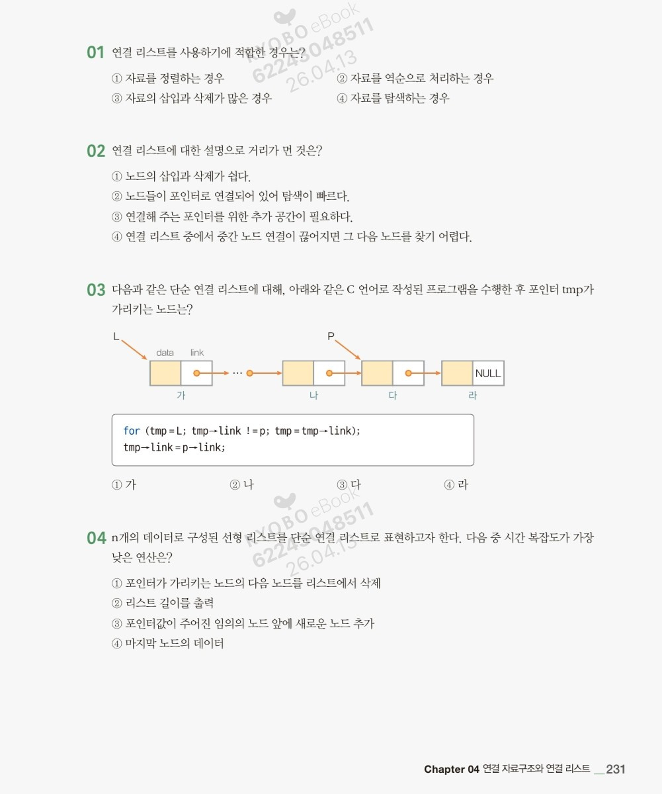

# 알고리즘 수업 정리 7주차

**01. 연결 리스트의 적합한 사용 사례**
• **정답: ③ 자료의 삽입과 삭제가 많은 경우**
• **해설:** 연결 리스트는 물리적으로 연속된 공간을 차지하지 않고 포인터로 연결되어 있습니다. 따라서 배열과 달리 데이터를 밀거나 당길 필요 없이 포인터만 바꿔주면 되므로 **삽입과 삭제**에 매우 효율적입니다.
    ◦ ①, ④번(정렬, 탐색)은 임의 접근이 가능한 배열이 더 유리할 때가 많습니다.

**02. 연결 리스트의 특징으로 틀린 것**
• **정답: ② 노드들이 포인터로 연결되어 있어 탐색이 빠르다.**
• **해설:** 연결 리스트의 가장 큰 단점 중 하나는 **탐색 속도**입니다. 특정 노드를 찾으려면 첫 번째 노드부터 순차적으로 따라가야 하는 **순차 접근(Sequential Access)** 방식이기 때문에 배열의 임의 접근(Random Access)보다 느립니다.
    ◦ ③번: 다음 노드 주소를 저장할 '링크(포인터)' 공간이 추가로 필요합니다.
    ◦ ④번: 중간 링크가 끊어지면 뒤쪽 노드들을 잃어버리게 됩니다.

**03. 코드 실행 후 tmp가 가리키는 노드**
• **정답: ② 나**
• **해설:**
    1. `for (tmp = L; tmp->link != p; tmp = tmp->link);`
        ▪ 이 루프는 `tmp`를 시작점 `L`에서부터 시작해, **`tmp->link`가 `p`가 될 때까지** 이동시킵니다.
        ▪ 그림에서 `p`가 가리키는 노드는 '다'입니다. 따라서 `tmp->link`가 '다'인 노드는 바로 이전 노드인 **'나'**입니다.
        ▪ 루프가 끝나면 `tmp`는 **'나'** 노드를 가리키고 있습니다.
    2. `tmp->link = p->link;`
        ▪ 이 문장은 '나' 노드의 링크를 '다' 노드의 다음 노드인 '라'로 연결하라는 뜻입니다. (노드 '다'를 삭제하는 과정)
        ▪ 하지만 질문은 **"포인터 tmp가 가리키는 노드"**를 묻고 있으므로, 루프 종료 시점의 위치인 **'나'**가 답입니다.

**04. 시간 복잡도가 가장 낮은 연산**
• **정답: ① 포인터가 가리키는 노드의 다음 노드를 리스트에서 삭제**
• **해설:**
    ◦ **①번 (O(1)):** 이미 타겟 노드의 이전 노드 포인터를 알고 있다면, 링크만 변경하면 되므로 즉시 처리가 가능합니다.
    ◦ ②번 (O(n)): 리스트의 길이를 알려면 처음부터 끝까지 개수를 세어야 합니다.
    ◦ ③번 (O(n)): '임의의 노드 앞'에 추가하려면, 그 노드의 **이전 노드**를 찾아야 하므로 처음부터 탐색해야 합니다.
    ◦ ④번 (O(n)): 마지막 노드에 도달할 때까지 모든 노드를 거쳐야 합니다. (단, 마지막 노드 포인터를 따로 관리하지 않는 단순 연결 리스트 기준)

### **05. 단순 연결 리스트에서 노드 삭제**

이 문제는 표에 적힌 메모리 주소와 `link` 값을 따라가며 리스트의 연결 순서를 먼저 파악해야 합니다.

1. **현재 연결 상태 파악:**
    - 주소 **2000**(A)의 링크가 **2020**을 가리킴 → **A 다음은 C**
    - 주소 **2020**(C)의 링크가 **2010**을 가리킴 → **C 다음은 B**
    - 주소 **2010**(B)의 링크가 **2030**을 가리킴 → **B 다음은 D**
    - 주소 **2030**(D)의 링크가 **0**(NULL)임 → **D가 마지막**
    - **순서: A → C → B → D**
2. **자료 B를 삭제할 경우:**
    - B를 리스트에서 빼려면, B의 **이전 노드인 C**가 B의 **다음 노드인 D**를 직접 가리키게 수정해야 합니다.
    - 즉, **C의 link**가 D의 주소인 **2030**으로 바뀌어야 합니다.
- **정답: ④ C의 link → 2030**

---

### **06. 두 노드 사이에 새로운 노드 삽입**

`first` 노드와 `second` 노드 사이에 새로운 노드 `tmp`를 삽입하는 올바른 코드 순서를 찾는 문제입니다. 연결 리스트 삽입의 골든 룰은 **"새 노드의 다리를 먼저 연결하고, 앞 노드의 다리를 끊는 것"**입니다.

1. **1단계: `tmp`가 `second`를 가리키게 하기**
    - 현재 `first->link`가 `second`의 주소를 가지고 있습니다.
    - 따라서 `tmp->link = first->link;` (또는 `tmp->link = &second;`)를 통해 새 노드 `tmp`가 뒷순서인 `second`를 먼저 가리키게 합니다.
2. **2단계: `first`가 `tmp`를 가리키게 하기**
    - 이제 `first`의 링크를 새 노드 `tmp`로 업데이트합니다.
    - `first->link = &tmp;`
- **보기 분석:**
    - **②번:** `tmp->link = first.link;` (기존에 first가 가리키던 second를 tmp가 가리킴) → `first.link = &tmp;` (이제 first가 tmp를 가리킴).
    - 문제에서 구조체 변수가 포인터가 아닌 일반 변수(`struct node first;`)로 선언되었으므로, 주소 연산자 `&`와 마침표 `.`를 사용한 표현이 문법적으로도 맞습니다.
- **정답: ②**
    - `tmp.link = first.link;`
    - `first.link = &tmp;`

### **코드 분석**

**1. 리스트가 비어 있을 때 (`if (*ptr == NULL)`)**

- `ptr = node;`: 포인터 `ptr`이 새로운 노드를 가리키게 합니다.
- `node->link = node;`: **새로운 노드의 링크가 자기 자신을 가리키게** 합니다.
    - 노드가 하나뿐인데 자기 자신을 가리킨다는 것은 **원형(Circular)** 구조를 만든다는 결정적인 증거입니다.

**2. 리스트에 노드가 이미 있을 때 (`else`)**

- `node->link = (*ptr)->link;`: 새 노드의 링크가 현재 가리키는 노드(`ptr`)의 다음 노드를 가리키게 합니다.
- `(*ptr)->link = node;`: 현재 가리키는 노드(`ptr`)의 링크가 새 노드를 가리키게 합니다.
    - 이는 특정 노드(`ptr`) 뒤에 새로운 노드를 삽입하는 전형적인 과정입니다.

---

### **정답 및 해설**

- *정답: ③ 원형으로 연결된 단순 연결 리스트에서 ptr이 가리키는 노드의 뒤에 node를 삽입, 리스트가 비어 있으면 node로 새로 리스트를 만든다.*

**이유:**

1. **원형 연결 리스트:** 리스트가 비어 있을 때 `node->link = node`라고 설정하는 부분에서 단순 연결 리스트가 아닌 원형 구조임을 알 수 있습니다.
2. **단순 연결 리스트:** 구조체 정의를 보면 `link` 포인터가 하나뿐이므로 이중 연결 리스트가 아닌 단순 연결 리스트입니다.
3. **삽입 위치:** `else` 문에서 `(*ptr)->link` 값을 조정하는 방식은 `ptr` 노드 바로 **뒤**에 새로운 노드를 끼워 넣는 로직입니다.

### **알고리즘 분석**

주어진 코드의 구조를 보면 각 포인터는 다음과 같은 역할을 합니다.

- **`p`**: 아직 처리되지 않은 리스트의 '다음 노드'를 가리킵니다. (탐색용)
- **`q`**: 현재 링크 방향을 바꿀 '기준 노드'입니다.
- **`r`**: 이미 방향이 바뀐 '이전 노드'들을 가리킵니다.

### **순서대로 따라가기 (루프 내부)**

`while` 루프가 한 번 돌 때마다 수행되어야 하는 논리적 순서는 다음과 같습니다.

1. **포인터 이동 (준비 단계):**
    - 이전 루프에서 `q`였던 노드는 이제 `r`(이전 노드)이 됩니다. (**`r = q;`**)
    - 이전 루프에서 `p`였던 노드(처리할 노드)는 이제 `q`(현재 노드)가 됩니다. (**`q = p;`**)
    - **이것이 바로 빈칸 ㉠에 들어갈 내용입니다.**
2. **다음 노드 확보:**
    - `p = p->link;` (현재 노드 `q`의 다음 노드를 미리 `p`에 저장해둡니다. 그래야 링크를 끊어도 다음으로 넘어갈 수 있습니다.)
3. **링크 방향 뒤집기:**
    - `q->link = r;` (현재 노드 `q`가 이전 노드인 `r`을 가리키게 하여 방향을 역전시킵니다.)

---

### **정답 및 결론**

- **정답: ② r = q; q = p;**

**해설:**
빈칸 뒤의 코드(`p = p->link;`, `q->link = r;`)가 제대로 동작하려면, 그전에 **`r`은 현재의 `q`로**, **`q`는 다음 타겟인 `p`로** 한 칸씩 밀려와 있어야 합니다. 만약 이 순서가 바뀌거나 다른 값이 들어가면 리스트의 연결이 끊기거나 무한 루프에 빠지게 됩니다.

마지막에 `start = q;`를 통해 역순으로 정렬된 리스트의 새로운 시작점을 지정하며 알고리즘이 종료됩니다.